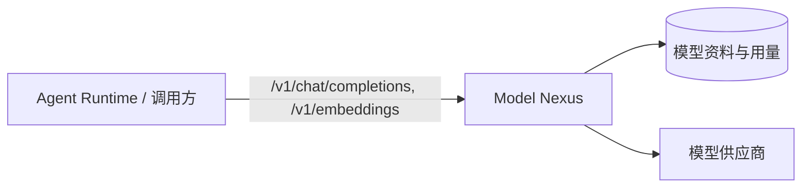

# 架构总览

Model Nexus 是模型访问边界：维护模型服务目录、接入资料和用量记录，将 OpenAI 风格请求转换并按协议路由至 OpenAI、Anthropic 或 Google GenAI 客户端。

```mermaid
flowchart LR
  Runtime[Agent Runtime / 调用方] -->|/v1/chat/completions, /v1/embeddings| Nexus[Model Nexus]
  Nexus --> Catalog[(模型资料与用量)]
  Nexus --> Providers[模型供应商]
```

不负责 Agent 任务编排、工具注册或 Agent/Skill 的配置管理。
